[![Contributors][contributors-shield]][contributors-url]
[![Forks][forks-shield]][forks-url]
[![Stargazers][stars-shield]][stars-url]
[![Issues][issues-shield]][issues-url]
[![project_license][license-shield]][license-url]
[![LinkedIn][linkedin-shield]][linkedin-url]


<br />
<div align="center">
  <a href="https://github.com/Kevinnnnn-ai/Project_Hinge_Point">
    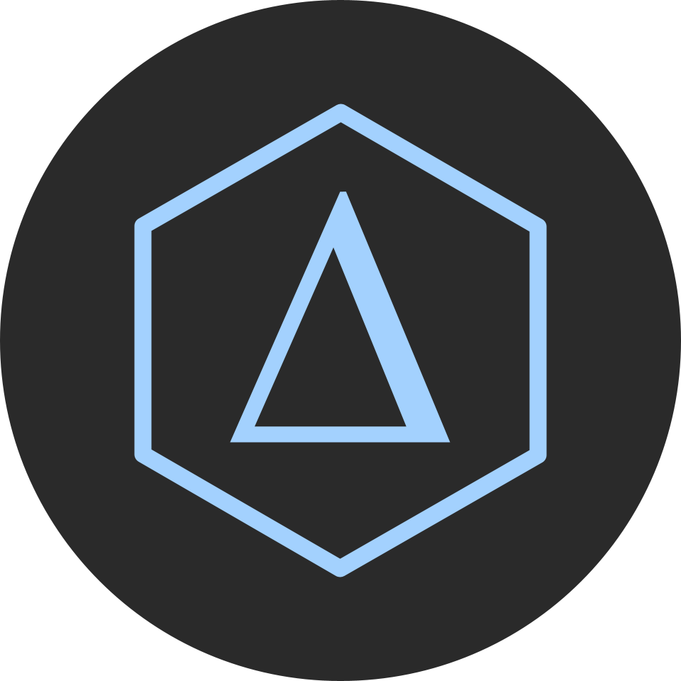
  </a>

<h3 align="center">Project Hinge Point</h3>

  <p align="center">
    Turning educational data into instructional insight.
    <br />
    <a href="https://github.com/Kevinnnnn-ai/Project_Hinge_Point"><strong>Explore the docs »</strong></a>
    <br />
    <br />
    <a href="https://project-hinge-point.streamlit.app/">View Demo</a>
    &middot;
    <a href="https://github.com/Kevinnnnn-ai/Project_Hinge_Point/issues/new?labels=bug&template=bug-report---.md">Report Bug</a>
    &middot;
    <a href="https://github.com/Kevinnnnn-ai/Project_Hinge_Point/issues/new?labels=enhancement&template=feature-request---.md">Request Feature</a>
  </p>
</div>

<details>
  <summary>Table of Contents</summary>
  <ol>
    <li>
      <a href="#about-the-project">About The Project</a>
      <ul>
        <li><a href="#built-with">Built With</a></li>
      </ul>
    </li>
    <li>
      <a href="#getting-started">Getting Started</a>
      <ul>
        <li><a href="#prerequisites">Prerequisites</a></li>
        <li><a href="#installation">Installation</a></li>
      </ul>
    </li>
    <li><a href="#usage">Usage</a></li>
    <li><a href="#roadmap">Roadmap</a></li>
    <li><a href="#contributing">Contributing</a></li>
    <li><a href="#license">License</a></li>
    <li><a href="#contact">Contact</a></li>
    <li><a href="#acknowledgments">Acknowledgments</a></li>
  </ol>
</details>


## About The Project

Upfront Metric Display   | Interactive Tools              | Statistical Summaries              |  Clear Visualizations
:-----------------------:|:------------------------------:|:----------------------------------:|:--------------------------------:
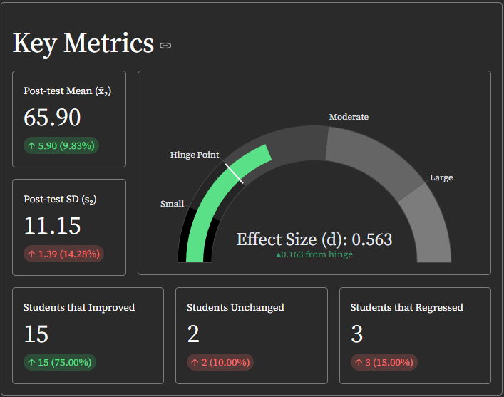 | 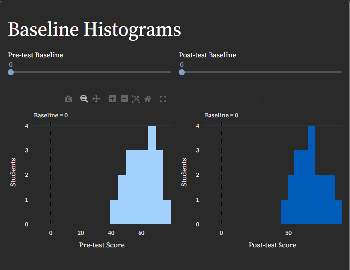 | 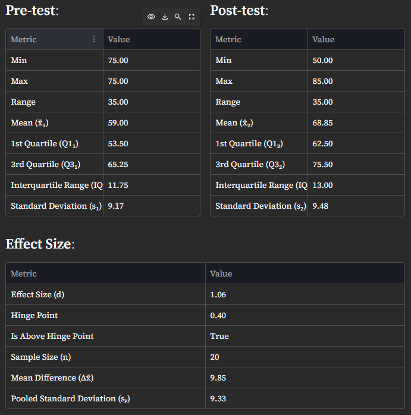 | 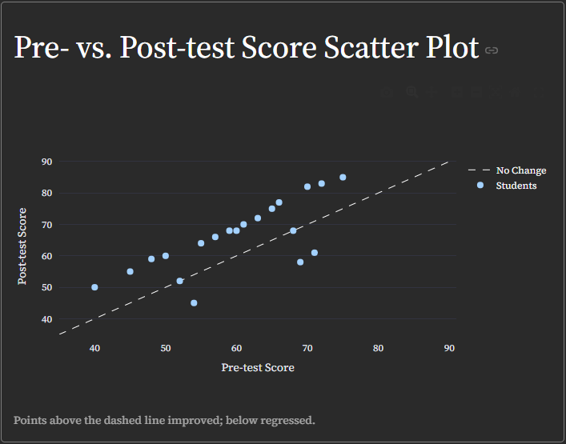

Project Hinge Point is your go-to, simplistic tool for calculating
teaching efficacy. Using John Hattie's effect size and concept of "visible learning,"
Project Hinge Point calculates and visualizes uploaded grade data so you can determine
how effective your teaching methods are and what changes you should make.

<p align="right">(<a href="#readme-top">back to top</a>)</p>


### Built With

<div align="left">
  <a href="https://www.python.org/">
    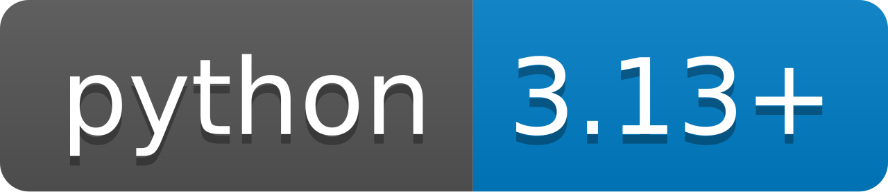
  </a>
</div>

<div align="left">
  <a href="https://streamlit.io/">
    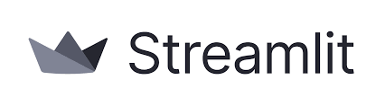
  </a>
</div>

<p align="right">(<a href="#readme-top">back to top</a>)</p>


## Getting Started

To get a local copy of this Streamlit application, follow these simple steps.
Once creating your own local copy, you can run it on your system using a web browser.

Though, publishing the cloned copy is a different story.
Being my personal Streamlit application, publishing it would be redundant.
In fact, you can view it [here](https://project-hinge-point.streamlit.app/)!

However, if you wish to publish the copy, follow [Streamlit's](https://streamlit.io/#install)
steps as listed on the website.


### Installation

1. Switch to desired directory.
   ```sh
   cd DIRECTORY
   ```
2. Clone the repository.
   ```sh
   git clone https://github.com/Kevinnnnn-ai/Project_Hinge_Point.git
   ```
3. Move into the project directory.
   ```sh
   cd Project_Hinge_Point
   ```
4. Install dependencies in `requirements.txt`.
    ```sh
    pip install -r requirements.txt
    ```

<p align="right">(<a href="#readme-top">back to top</a>)</p>


## Usage

Given you have a local copy, you can run it on your local system using Streamlit.
```sh
streamlit run src/main.py
```

Once in the application, ...

Navigate pages using the side bar   | Create workspaces with the side bar button
:----------------------------------:|:-------------------------------------------:
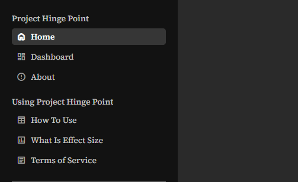               | 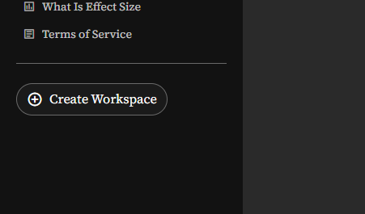 

Through your created workspaces, you can ...

Calculate your effect size | Get statistical break downs        | Interact with the baseline histograms
:-------------------------:|:----------------------------------:|:-------------------------------------:
   |  | 

Compare score distributions        | Analyze change disparaties       | View student improvement
:---------------------------------:|:--------------------------------:|:-------------------------:
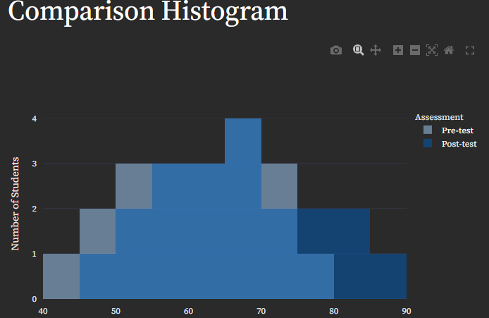 | 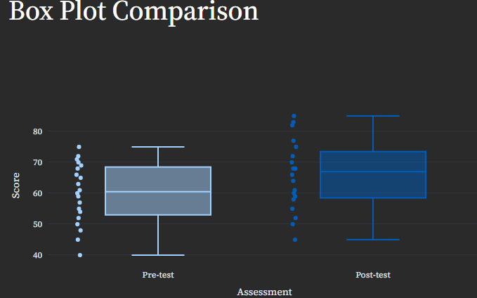 | 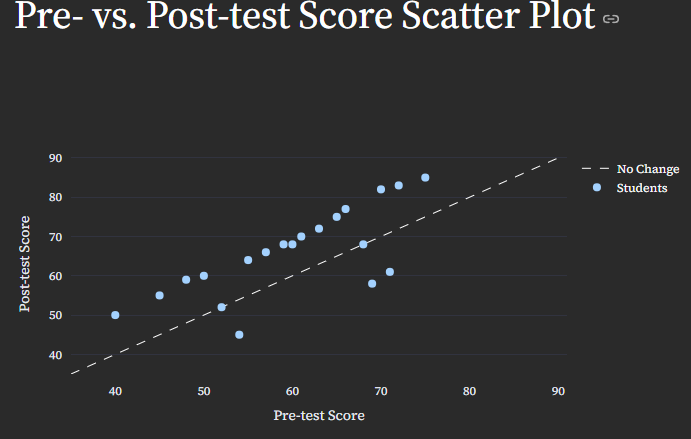 

---

Simply follow the instructions and descriptions given on each page to learn about the application's functionality,
or visit the "*How To Use*" page under "*Using Project Hinge Point*" to read more.

*To view the site, refer to [Project Hinge Point](https://project-hinge-point.streamlit.app/)*

*To read more about Streamlit itself, please refer to the [docs.streamlit](https://docs.streamlit.io/get-started)*

<p align="right">(<a href="#readme-top">back to top</a>)</p>


## Roadmap

- [ ]

See the [open issues](https://github.com/Kevinnnnn-ai/Project_Hinge_Point/issues) for a full list of proposed features (and known issues).

<p align="right">(<a href="#readme-top">back to top</a>)</p>


## Contributing

Contributions are what make the open source community such an amazing place to learn,
inspire, and create. Any contributions you make are **greatly appreciated**.

If you have a suggestion that would make this better,
please fork the repo and create a pull request. You can also simply open an issue with the tag "enhancement".
Don't forget to give the project a star! Thanks again!

1. Fork the Project
2. Create your Feature Branch (`git checkout -b feature/AmazingFeature`)
3. Commit your Changes (`git commit -m 'Add some AmazingFeature'`)
4. Push to the Branch (`git push origin feature/AmazingFeature`)
5. Open a Pull Request

<p align="right">(<a href="#readme-top">back to top</a>)</p>


### Top contributors:

<a href="https://github.com/Kevinnnnn-ai/Project_Hinge_Point/graphs/contributors">
  
</a>


## Contact

Kevin Jie - [kevin-jie-21a477368](https://www.linkedin.com/in/kevin-jie-21a477368/) - kevinwjie@gmail.com

Project Link: [https://github.com/Kevinnnnn-ai/Project_Hinge_Point](https://github.com/Kevinnnnn-ai/Project_Hinge_Point)

<p align="right">(<a href="#readme-top">back to top</a>)</p>


<!-- MARKDOWN LINKS & IMAGES -->
<!-- https://www.markdownguide.org/basic-syntax/#reference-style-links -->
[contributors-shield]: https://img.shields.io/github/contributors/Kevinnnnn-ai/Project_Hinge_Point.svg?style=for-the-badge
[contributors-url]: https://github.com/Kevinnnnn-ai/Project_Hinge_Point/graphs/contributors
[forks-shield]: https://img.shields.io/github/forks/Kevinnnnn-ai/Project_Hinge_Point.svg?style=for-the-badge
[forks-url]: https://github.com/Kevinnnnn-ai/Project_Hinge_Point/network/members
[stars-shield]: https://img.shields.io/github/stars/Kevinnnnn-ai/Project_Hinge_Point.svg?style=for-the-badge
[stars-url]: https://github.com/Kevinnnnn-ai/Project_Hinge_Point/stargazers
[issues-shield]: https://img.shields.io/github/issues/Kevinnnnn-ai/Project_Hinge_Point.svg?style=for-the-badge
[issues-url]: https://github.com/Kevinnnnn-ai/Project_Hinge_Point/issues
[license-shield]: https://img.shields.io/github/license/Kevinnnnn-ai/Project_Hinge_Point.svg?style=for-the-badge
[license-url]: https://github.com/Kevinnnnn-ai/Project_Hinge_Point/blob/master/LICENSE.txt
[linkedin-shield]: https://img.shields.io/badge/-LinkedIn-black.svg?style=for-the-badge&logo=linkedin&colorB=555
[linkedin-url]: https://linkedin.com/in/kevin-jie-21a477368
[product-screenshot]: images/screenshot.png
<!-- Shields.io badges. You can a comprehensive list with many more badges at: https://github.com/inttter/md-badges -->
[Next.js]: https://img.shields.io/badge/next.js-000000?style=for-the-badge&logo=nextdotjs&logoColor=white
[Next-url]: https://nextjs.org/
[React.js]: https://img.shields.io/badge/React-20232A?style=for-the-badge&logo=react&logoColor=61DAFB
[React-url]: https://reactjs.org/
[Vue.js]: https://img.shields.io/badge/Vue.js-35495E?style=for-the-badge&logo=vuedotjs&logoColor=4FC08D
[Vue-url]: https://vuejs.org/
[Angular.io]: https://img.shields.io/badge/Angular-DD0031?style=for-the-badge&logo=angular&logoColor=white
[Angular-url]: https://angular.io/
[Svelte.dev]: https://img.shields.io/badge/Svelte-4A4A55?style=for-the-badge&logo=svelte&logoColor=FF3E00
[Svelte-url]: https://svelte.dev/
[Laravel.com]: https://img.shields.io/badge/Laravel-FF2D20?style=for-the-badge&logo=laravel&logoColor=white
[Laravel-url]: https://laravel.com
[Bootstrap.com]: https://img.shields.io/badge/Bootstrap-563D7C?style=for-the-badge&logo=bootstrap&logoColor=white
[Bootstrap-url]: https://getbootstrap.com
[JQuery.com]: https://img.shields.io/badge/jQuery-0769AD?style=for-the-badge&logo=jquery&logoColor=white
[JQuery-url]: https://jquery.com 